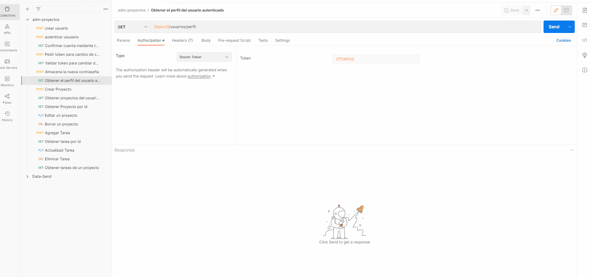
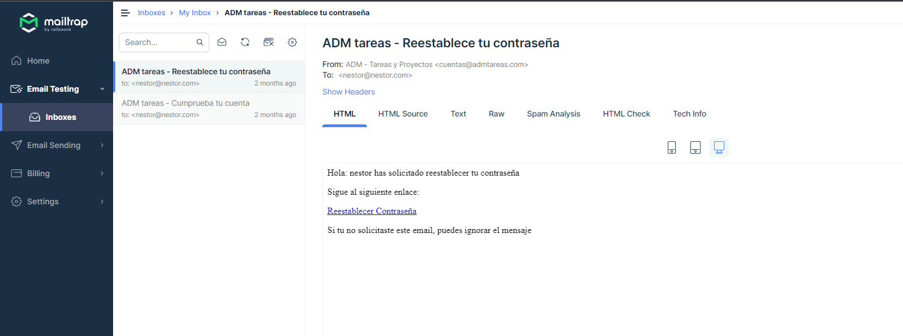

## Proyectos para administracion de proyectos

Deploy del sitio: [DATA-SEND](https://leafy-alfajores-9590cf.netlify.app)

### Frontend realizado con [VITE.js](https://nextjs.org/)

### Backend con [NODE.js](https://nodejs.org/en) y [MongoDB](https://www.mongodb.com/).

El usuario se autentica mediante correo electrónico, al igual que el cambio de contraseña. Se utiliza mailtrap para autenticar el usuario.

Usuario autenticado para probar el proyecto:
`usuario: nestor@nestor123 `
`contraseña: nestor123`

El usuario autenticado, puede crear/editar proyectos.
El usuario autenticado, puede crear/editar tareas.
El usuario autenticado, puede agregar/eliminar colaboradores del proyecto.
El usuario registrado pero no autenticado solo pueder completar las tareas en las que esta participando

- [vitejs](https://vitejs.dev/guide/)
- [axios](https://www.npmjs.com/package/axios)
- [bcrypt](https://www.npmjs.com/package/bcrypt)
- [cors](https://www.npmjs.com/package/cors)
- [dotenv](https://www.npmjs.com/package/dotenv)
- [jsonwebtoken](https://www.npmjs.com/package/jsonwebtoken)
- [socket.io](https://www.npmjs.com/package/socket.io)
- [nodemailer](https://www.npmjs.com/package/nodemailer)

